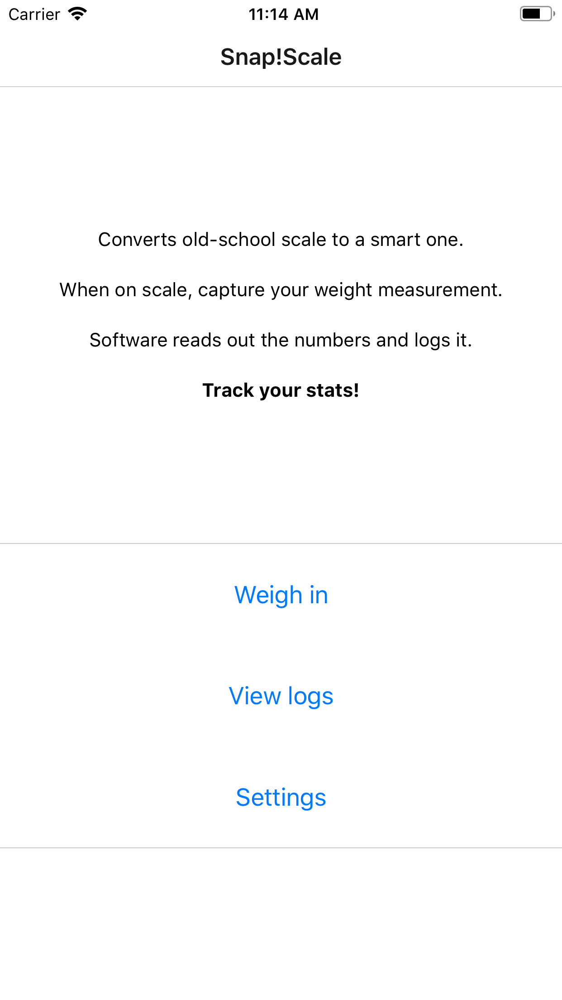
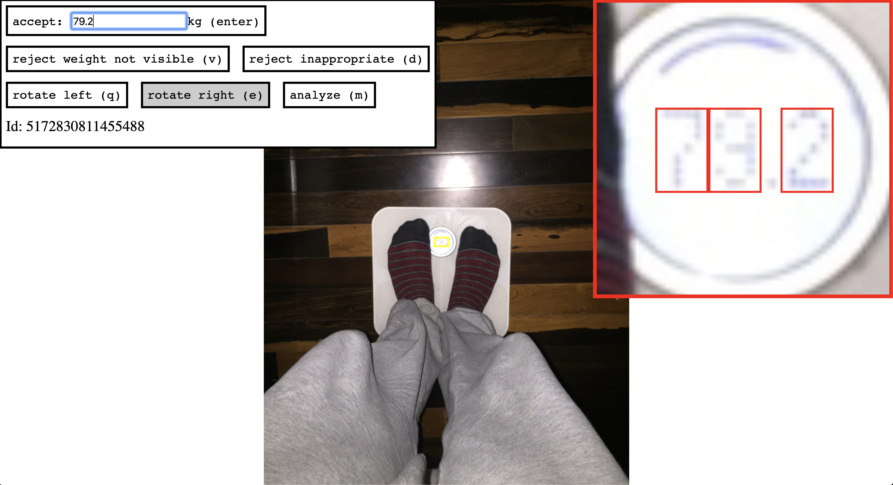
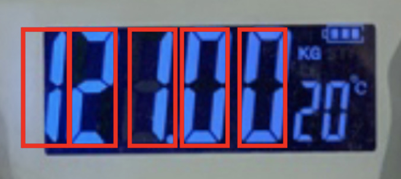
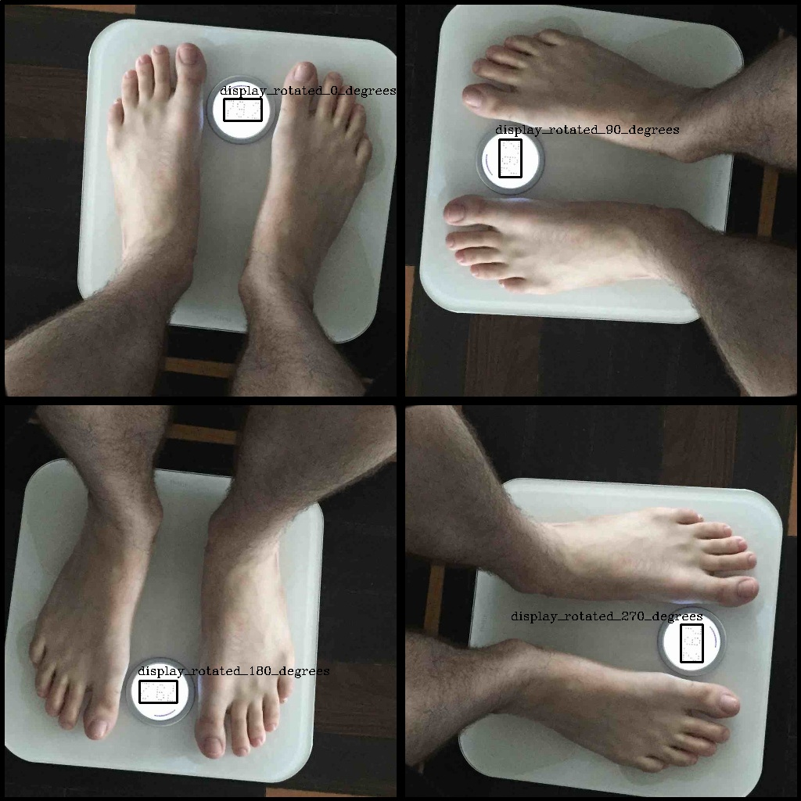

## Introduction 

I started drilling on SnapScale in mid-2018 with a goal of **creating a weigh-in habit** for a friend of mine. I converted their old school scale into a smart one **using the phone's camera**. The user scans the weight measurement with a phone and the app recognizes the value, logs it, and optionally exports to FitBit profile.

Feel free to try it out - no log-in or account creation is required - [SnapScale - build a weight-in habit](https://snapscale.life).

This report gives a timeline of a complete product heavily relying on ML tools.

### The goal of this report

I am writing this report to share my thoughts about:

- ML principles for real-world applications
- The state of ML tools today available on Google Cloud
- Rotation-invariant algorithm to detect a display on the image and read the weight value written on it

### Targeted audience

Software Engineers, Data Scientists, Product Managers and other Rock and Roll people.

Less likely, if you are using [the photo weigh-in application](https://snapscale.life), here you can learn how the AI behind it works.

## App implementation

### User-facing product

The goal of SnapScale is to instill a weigh-in habit in humans. Taking a weight measurement has an amplified awareness effect if the number is logged, and if you can compare it with last week, or last month. It's the trend that matters, not day-to-day oscillations.

The app lets you log the weight measurement by taking a photo of the scale's display while you're standing on the scale. User doesn't need to lean down - a photo taken from the normal hand height works. The AI model reads out the digits and logs the weight.

There are 3 screens in the app:

- submit a new weight-in measurement that launches a camera
- view your previous measurements
- settings screen that optionally sets up FitBit export and no-weigh-in reminders

<p align="center">
  
</p>

Tapping the weigh-in button launches the camera.

We intentionally reduced clutter that could waste the user's time in the app. There is no login required or account creating to start using the app. Optionally if a user wants to export their data to FitBit, the login with FitBit is required.

### AI Last

Engineering-wise, the central and most "sexy" part of the application is the component that reads the weight measurement from the image. I delayed tackling that part of the problem. Instead, I tried adopting the "AI Last" principle. That meant first doing the following:

- Built a mobile app for photo-based weight-logging, reminders, and export to FitBit.
- Launched with a fake backend - each image would trigger a notification on my phone for me to read the numbers instead of the ML model
- Implemented the UI for reading the numbers from images and labelling them
- Implemented the evaluation framework for image recognition problem

Only then, when everything was ready and it seemed that the product may work, I tackled the AI:
- picking the technology and implementing the image recognition solution

This is what I mean by AI comes last.

By the time I started iterating on the model, I labeled ~450 images and had a good idea of all kinds of corner cases that might happen. I also had a dataset of images, defined metrics, debugging frontend and evaluation framework in place.

One risk of this approach is betting everything on the fact that the last step (AI) will work. It could've happened that OCR at the end would be too difficult to implement, and the project would "fail slowly".

### Mobile app framework

The application is built using [Expo](https://expo.io) framework which is a wrapper around [React Native](https://reactnative.dev/).  It's suitable for fast prototyping which is exactly what I needed. Same codebase is executed on both platforms. If Expo had a book it would be called "App development for dummies".

### Backend

Backend is used to store weight logs and images. The clients don't do any authentication, but there is a lightweight handshake step.

On app install, users agree to Terms of Use using captcha as a signature. The successful captcha challenge gives a permanent session token to the application that is later required to communicate with the backend. I find this trick useful when designing an application + backend storage without requiring a login.

Although login sounds like a good alternative, I suspect it would repel some users due to sensitivity of the images that are being sent. This way we keep user images stripped of any other kind of PII.

Backend is deployed as a [NodeJS](https://nodejs.org) application on [Google App Engine](https://cloud.google.com/appengine). To get a free-of-charge deployment for prototypes with low amount of requests, the trick is to use `standard` environment with `F1` instance class. The `app.yaml` config looks like this:

```
runtime: nodejs12
env: standard
instance_class: F1
```

The database for metadata used is [Google Cloud Datastore](https://cloud.google.com/datastore) and for the image store I used [Google Cloud Storage](https://cloud.google.com/storage). Both systems are free-of-charge for prototypes with low amount of requests. Also, no setup is needed.

The natural next step is to move the model execution to the client, which will remove a need for a backend, and simplify privacy policy.

### Labelling UI

When a new image is submitted to the system, and the model is not confident about the results (or when the model was not even there yet) an [IFTTT](https://ifttt.com) notification would hit my phone with the link to the Labelling UI. The Labelling UI would show the image, let me translate and rotate it, and label the digits. The digits are labeled with rectangles that all share `y` coordinates, and all have the same dimensions. This is possible because prior to labelling the digits, the labeller rotates the image in such a way that the display is upright.

<p align="center">
  
</p>

Note that I made an assumption that the digits are always monospace. Well :) Assumption turns out to be the mother of all fuckups.

<p align="center">
  
</p>

I manually labeled ~450 images so far. Each image has 3-4 digits, each digit is two mouse clicks. The Labelling UI is implemented in HTML5, mainly using Canvas API in JavaScript. The image transformation logic heavily uses affine transformation matrices - [DOMMatrix](https://developer.mozilla.org/en-US/docs/Web/API/DOMMatrix).

The images without visible weight measurement are discarded. All other images are labeled and split into training/test/validation with 70/10/20 ratios.

Having only valid images in the dataset, I defined `accuracy` to be my main metric:

- **accuracy**: percentage of images in which all digits are correctly identified

If an image that shows `78.2` gets recognized as `78.3`, the accuracy is not satisfied.

## Image recognition

I started working on Image recognition ~2 months in the project. At that time, I had an application that works, with 1-2 OCR requests per day all labeled manually. I was ready to implement the digit recognition submodule. I expected that I will find something that works out of the box, and that most of engineering will be just plugging it in and evaluating accuracy.

### Existing work

I found a bunch of existing related models that would in theory solve our problem. Reproducibility of those projects was low.

Classical computer vision techniques on GitHub:

* [github.com/jacnel/wetr](https://github.com/jacnel/wetr)
* [github.com/NatholBMX/ScaleDigitizer](https://github.com/NatholBMX/ScaleDigitizer)
* [charleswest/Weight](https://github.com/charleswest/Weight)
* [suyashkumar/seven-segment-ocr](https://github.com/suyashkumar/seven-segment-ocr)
* [kazmiekr/GasPumpOCR.git](https://github.com/kazmiekr/GasPumpOCR.git)
* [bikz05/digit-recognition](https://github.com/bikz05/digit-recognition)
* [g-sari/pyautodigits](https://github.com/g-sari/pyautodigits)

Classical computer vision techniques articles:

* [Reading LCD/LED Displays with a Camera Cell Phone](http://www.dccia.ua.es/~sco/ComputerVision/embedded.pdf)
* [Building a Gas Pump Scanner with OpenCV/Python/iOS](https://hackernoon.com/building-a-gas-pump-scanner-with-opencv-python-ios-116fe6c9ae8b))
* [Build a Multi Digit Detector with Keras and OpenCV](https://towardsdatascience.com/build-a-multi-digit-detector-with-keras-and-opencv-b97e3cd3b37)
* [Scanned Numbers Recognition using k-Nearest Neighbor (k-NN)](https://towardsdatascience.com/scanned-digits-recognition-using-k-nearest-neighbor-k-nn-d1a1528f0dea)
* [Dumb thermometer gets digital output](https://www.kurokesu.com/main/2017/02/20/dumb-thermometer-gets-digital-output/)
* [Recognizing digits with OpenCV and Python](https://www.pyimagesearch.com/2017/02/13/recognizing-digits-with-opencv-and-python/)
* [Text detection and recognition in raw image dataset of seven segment digital energy meter display](https://www.sciencedirect.com/science/article/pii/S235248471930174X)

Street View House Number Dataset related solutions:

* [Getting Started with ‘Street View House Numbers’ (SVHN) Dataset](https://medium.com/project-agi/getting-started-with-street-view-house-numbers-svhn-dataset-a96e76962504)
* [Multi-digit Number Recognition from Street View Imagery using Deep Convolutional Neural Networks](https://arxiv.org/pdf/1312.6082.pdf)
* [The Street View House Numbers (SVHN) Dataset](http://ufldl.stanford.edu/housenumbers/)
* [github.com/potterhsu/SVHNClassifier](https://github.com/potterhsu/SVHNClassifier)
* [A SVHN-related project report](https://github.com/znat/udacity-digit-recognition-program-svhn/blob/master/project-report/project-report.md)

Open Source Tensorflow Object Detection pipeline:

* [github.com/tensorflow/models research/object_detection](https://github.com/tensorflow/models/tree/master/research/object_detection)

Documentation about Google Cloud object detection solutions as service:

* [Google Cloud Vision API](https://cloud.google.com/vision)
* [Google Cloud AutoML Vision Object Detection](https://cloud.google.com/vision/automl/object-detection/docs)
* [Google Cloud AI Platform built-in Object Detection](https://cloud.google.com/ai-platform/training/docs/algorithms/object-detection-start)

My time in investigating and trying out existing solutions was roughly spent like this:

- `30%` Classical computer vision techniques (OpenCV and similar)
- `30%` SVHN dataset
- `2%` Google Cloud Vision API
- `38%` Tensorflow custom solutions and transfer learning

I implemented 5-6 different pipelines that will take SnapScale images and labels and convert them to a format that the solutions above take :) That's a lot of hours spent debugging bugs in geometry and image processing code.

I didn't expect to get in a situation where I'll be (re)training new models. Especially because I had only 450 images available.

### Iterations with custom-trained object detection

From their documentation, [Google Cloud AutoML Vision Object Detection](https://cloud.google.com/vision/automl/object-detection/docs) looks too good to be true. The Web UI enables you to upload images, train the model and see evaluation results. The trainer uses transfer learning which enables it to train something useful even with a few hundred images only. No setup, no config.

Naive as I am, I started by training a model that solves everything at once: read digits from raw user image. The input is the raw user image, and the output are labeled digit rectangles.

This hit two problems:

* the 7-segment digits sometimes change meaning with rotation (think 2 and 5)
* the digit was sometimes too small on the original image for the model to pick up

The rotation problem is amplified by the fact that the mobile phone doesn't know how to orientate the image of something that is on the floor.

I decided to split the problem to two phases:

* detecting the display in the big image,
* detecting the digits in the display.

Each phase can be evaluated on its own, which is useful in loss analysis.

#### Display detection

My first attempt was predicting a single rectangle of a single class `display` on the input image. The training set was consisting of upright rotated images labeled with a single rectangle around the display. The AutoML Object Detection learned this with very good precision. At prediction time I would rotate the image 4 times and find the maximum confidence score for the display detection. I assumed that the maximum confidence would be achieved when the display is in upright rotation, just as it was in the training set.

I was wrong. I violated the property that training input distribution needs be aligned with the runtime input distribution. The model training saw only correctly rotated images, so the confidences that I was getting for the incorrectly rotated images were rubbish - sometimes 0, sometimes 1.

<p align="center">
  
</p>

The green detection box represents the input that was expected by the model, and the scores there are precise. The red detection boxes have scores that have no guarantees.

To fix this, I made the problem harder for the model. I expanded each image in the input to `K=4` new images with different rotations. Rotations are done in `360 / K = 90` increments, starting from the upright image. The display label on the upright image became `display_rotated_0_degrees`. On the next image it became `display_rotated_90_degrees`, then `display_rotated_180_degrees` and `display_rotated_270_degrees`. So the number of input images and output classes grew `K` times.

<p align="center">
  
</p>

During the prediction I would show the input image to the model. The output is the display location and how much it was rotated from the upward position.

This worked much better, but it still had some precision losses. The final slam dunk for display+rotation detection was the voting system during prediction. Because the training phase received `K` rotations of each image, now it became OK to present the model with `K` rotations of the input image during prediction time. Each of the `K` rotations would give some answer to where the display is and how it's rotated.

If the model was perfect, all evaluations would show the same display location, and rotation hints would yield different values (`0`, `90`, `180`, `270`) for each rotation.

The final answer is given by subtracting the model's rotation hint from the image rotation given to the model. Implementing a voting scheme here gave surprisingly good results.

Note that the hyper-parameter `K` doesn't need to be `4`. If the model is perfect, the maximum angle distance of the hinted rotation and the correct rotation is `(360 / K) / 2`. If `K` is bigger, the display detection problem is more difficult. On the other hand, the outputs are closer to being upright rotated, which makes the digit detection problem less difficult.

#### Digit detection

Digit detection inputs an upright display image and outputs rectangles labeled as digits: `digit_{0-9}`.

<p align="center">
  
</p>

I expected this to be simple for the AutoML Object Detection. Wrong again! Nothing is simple. I got many precision losses which I couldn't easily explain.

<p align="center">
  
</p>


Looking through the open sourced `object_detection` Tensorflow on GitHub, which I suspected AutoML was using, I found a parameter [`aug_rand_flip`](https://github.com/tensorflow/models/blob/master/official/vision/detection/dataloader/shapemask_parser.py#L131). Based on the docs, the parameter expands input training images with their horizontal flips. This parameter can't be configured in AutoML Object Detection, but if they set it to true it would surely screw up 7-segment digit object detection.

<p align="center">
  
</p>

Google Cloud support answered my question on [cloud-vision-discuss thread](https://groups.google.com/forum/?utm_medium=email&utm_source=footer#!msg/cloud-vision-discuss/6mrbUdWcVys/Tv4nXRy8BAAJ), which helped me understand that AI Platform Object Detection and AutoML Object Detection are quite different.

I submitted a training job to AI Platform (after building yet another pipeline to transform my data), and got excellent results. This was another surprise, because my training set was less than 400 images, and the AI Platform Object Detection trains from scratch - it doesn't do transfer learning.

### Results

In the last iteration I used 468 images:

- 317 images in training set
- 50 images in test set
- 101 images in validation set

I never saw debug visualizations or debug logs of the images in the validation set - the evaluation pipeline would never produce them.

The final accuracies (the weight value correctly recognized):

- 98.74% in training set
- 94.00% in test set
- 93.07% in validation set

The detection latency is ~15 seconds, mostly because I optimized serving to be price efficient (free).

## Conclusion

### The state of Object Detection support

I am surprised by the simplicity and efficiency of Google Cloud AutoML Object Detection. When it comes to pricing, each account gets $300 free quota which is enough to train 5-10 model iterations. If you are lucky to get the result you need in that quota, everything else can be free - they give the ability to download the trained model as a Docker container, TF.js bundle or TF Lite bundle.

Using this free quota I managed to train a successful weight scale measurement OCR system.

### ML principles I violated and got burnt

**The distribution of data during prediction must align with the distribution of data during training.**

I broke this principle multiple times. First, I thought that SVHN trained models would do a good job in recognizing scale weight measurement numbers. Lol, no. The transfer learning from the SVHN model to my problem space also didn't end up working.

During display orientation detection, I broke this principle again - I thought that the model trained on upright display images would give a low score to input images that are not upright. The score was not low - it was rubbish, sometimes high, sometimes low.

When it comes to the data collection phase, I think I got it right, at least in this principle. To collect the training dataset I built the application in its final form, with a fake model (myself as human labeller). Once the model was ready, I just swapped out the human.

**Be evaluation driven.**

Early in the project when I was evaluating the related work, I would try to run the existing model and then feed it with an image or two to see how it works. Only when my custom quality iterations started, I built a pipeline that runs the model on all train/test/val images and reports the metrics.

It would be better if I defined a container interface early on that listens to the image request on HTTP and gives a standardised JSON output. Then I would have a Docker image for every related work I managed to successfully run, persisted together with evaluation results. Having not done so, I only have weak (empirical) evidence that the related work models didn't work on my problem space.

When it comes to running things from other research-y works, the dependencies pose a big challenge. Docker solves this problem completely, and I am looking forward to seeing Docker adoption in academia.

**Be loss analysis driven.**

During loss analysis, it would happen to me that after I've seen 2 similar failures I would rush into implementing a hotfix for that specific pattern. This hotfix would always get reverted later on. Implementing hotfixes for specific losses (instead of biggest loss patterns) only increases the model complexity and, in my experience, it doesn't reflect wins in validation set metric. The lesson learned here is to be patient, finish analyzing all losses that you prepared and then decide on the next step.

### Parting words

On Monday, 2019-10-28 I was in a room in downtown Manhattan packed with excited engineers and PMs who were ready to take over the world. This was AWS Data Lake Day in AWS Loft. I clearly remember a specific sentence - the speaker said confidently:

> You've gotta use ML! If you don't, chances are that your competitors will.

I hated it. On the other hand, in the audience I saw ripples of head-nodding folks getting high on agreement with the speaker.

I decided to embrace a different engineering principle - "Don't go AI first - always stay user first". ML is a tool, not a goal.

Even The Doors knew this when they played The Roadhouse Blues. They say:

> Yeah, keep your eyes on the road, your hands upon the wheel.

For **the road**, they probably meant **user goal** and for **the wheel** they meant **the tools** - whatever tools are needed - a for-loop, a compiler, a database or an ML model.
